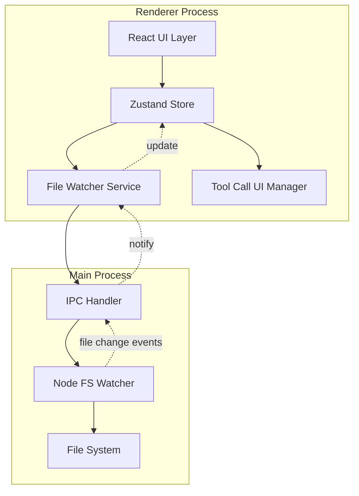

# Design Document: UX Improvements

## Overview

本设计文档描述了 Adnify 编辑器的用户体验改进架构，重点解决工具调用交互、文件系统响应性和 UI 一致性问题。设计参考了 Cursor 编辑器和 VS Code 的最佳实践。

## Architecture



## Components and Interfaces

### 1. File Watcher Service

```typescript
// src/renderer/services/fileWatcherService.ts
interface FileWatcherService {
  // 开始监听工作区
  startWatching(workspacePath: string): void
  // 停止监听
  stopWatching(): void
  // 订阅文件变化
  onFileChange(callback: (event: FileChangeEvent) => void): () => void
  // 手动触发刷新
  refresh(): Promise<void>
}

interface FileChangeEvent {
  type: 'create' | 'modify' | 'delete' | 'rename'
  path: string
  oldPath?: string // for rename
  timestamp: number
}
```

### 2. Tool Call UI Manager

```typescript
// src/renderer/services/toolCallUIService.ts
interface ToolCallUIService {
  // 创建工具调用 UI 状态
  createToolCall(toolCall: ToolCallInfo): string
  // 更新工具调用状态
  updateStatus(id: string, status: ToolCallStatus): void
  // 设置工具结果
  setResult(id: string, result: string): void
  // 获取所有活跃的工具调用
  getActiveToolCalls(): ToolCallUIState[]
}

interface ToolCallUIState {
  id: string
  name: string
  status: 'pending' | 'running' | 'success' | 'error' | 'awaiting'
  arguments: Record<string, unknown>
  result?: string
  error?: string
  startTime: number
  endTime?: number
  // 文件编辑特有
  affectedFiles?: string[]
}


### 3. Enhanced Store State

```typescript
// 扩展 store 状态
interface EnhancedEditorState {
  // 文件状态
  fileStates: Map<string, {
    isDirty: boolean
    lastModified: number
    externallyModified: boolean
  }>
  
  // 工具调用 UI 状态
  toolCallsUI: ToolCallUIState[]
  
  // 文件监听状态
  watcherActive: boolean
  
  // Actions
  markFileDirty: (path: string) => void
  markFileSaved: (path: string) => void
  updateFileFromExternal: (path: string, content: string) => void
  addToolCallUI: (toolCall: ToolCallUIState) => void
  updateToolCallUI: (id: string, updates: Partial<ToolCallUIState>) => void
}
```

## Data Models

### Tool Call Display Model

```typescript
interface ToolCallDisplayConfig {
  // 工具类型到显示配置的映射
  [toolName: string]: {
    icon: string
    label: string
    showArgs: boolean
    showResult: boolean
    compactMode: boolean
    // 文件编辑工具特殊处理
    isFileEdit?: boolean
  }
}

const TOOL_DISPLAY_CONFIG: ToolCallDisplayConfig = {
  read_file: { icon: 'FileText', label: 'Reading', showArgs: false, showResult: true, compactMode: true },
  write_file: { icon: 'FileEdit', label: 'Writing', showArgs: false, showResult: false, compactMode: true, isFileEdit: true },
  edit_file: { icon: 'FileEdit', label: 'Editing', showArgs: false, showResult: false, compactMode: true, isFileEdit: true },
  run_command: { icon: 'Terminal', label: 'Running', showArgs: true, showResult: true, compactMode: false },
  // ...
}
```


## Correctness Properties

*A property is a characteristic or behavior that should hold true across all valid executions of a system.*

### File Watcher Properties

**Property 1: File change notification**
*For any* file modification in the watched workspace, the file watcher SHALL emit a change event within 500ms.
**Validates: Requirements 2.1, 2.4**

**Property 2: Open file sync**
*For any* file that is both open in the editor and modified externally, the editor content SHALL be updated or the user SHALL be prompted.
**Validates: Requirements 2.2, 2.5**

### Tool Call UI Properties

**Property 3: Tool call status progression**
*For any* tool call, the status SHALL progress through valid states only (pending → running → success/error).
**Validates: Requirements 1.1, 1.4**

**Property 4: File edit display**
*For any* edit_file or write_file tool call, the UI SHALL display only the file name, not the full diff.
**Validates: Requirements 1.2**

### Message Flow Properties

**Property 5: No duplicate messages**
*For any* AI response, tool outputs SHALL be embedded in tool call cards, not as separate messages.
**Validates: Requirements 3.2**

## Error Handling

- **File Watcher Errors**: Gracefully handle permission denied, file not found
- **External Modification Conflicts**: Prompt user to choose between local and external version
- **Tool Call Failures**: Display clear error message with retry option

## Testing Strategy

### Unit Tests
- File watcher event emission
- Tool call state transitions
- Store state updates

### Property-Based Tests
- File change detection timing
- Tool call status progression
- Message deduplication

### Integration Tests
- End-to-end file modification flow
- Tool call UI updates
- Editor state synchronization
